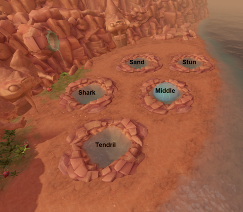
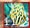
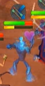

# Yakamaru Guide

This was a guide written by me to help ease members of [Helpful clan] into raids. It is meant for newcomers (as well as people who want to try new roles in raids) to read and know stuff such that raids have a less likely chance of failing.


**Basic Raid Map**

[Picture CR: Johnna]




__General House Rules__


**0) Prayers**
pray ranged if you are not in melee distance (`MD`), pray magic if you are in MD


**1) Enrage Mechanic**

 < watch out for this in your debuff bar (enrage stacks)

```
If you get a debuff icon and the text "Yakamaru's water begins to drench you," (x1.2 damage taken.) "Yakamaru's waters begin to soak through you," (x2 dmg taken) and "Yakamaru's waters conducts his full power." (x3 dmg taken), it is the base tank fault, so just :

Use freedom. It halves the number of enrage stacks you have

tldr; if yaka angry, yaka hurty, so use freedom

```

**2) Sand Mechanic**

```
Sand mechanic happens when you are on the sand pool, as well as in mirage phase. 
All but 2 members of the raid (the 2 lowest dps guys) will be sanded. 
Those not sanded will receive a text box notification, those that are sanded will not receive a text box notification. 

If you sink all the way in, you die. Instant kill. Sign of life works here though.

DO NOT IGNORE. Spam click on nearby players, but prioritise tanks/cpr. If tanks die, the whole raid dies.
```

**3) Stun Pool Mechanic**

```
Do not use any stuns on stun pool (except stunner) as you will deal anywhere between 1000 - 5000 dmg to the entire raid. Asphyxiate will probably kill the entire raid because it is a chain stun. Please be wary of this. People who asphyxiate the stun pool will pay for everyone's deaths (800k per death assuming current price of onyx)

```
**4) Shark pool Mechanic**

```
Yaka spits out some sharks some time into fighting shark pool. Just surge/escape away after shark has landed on you, else the sharks may follow you after u surge and hit everyone too
```

**5) Tendril pool Mechanic**

```
Some time into Tendril pool, yaka will choke you with tendrils. Simply up your dps game, use some thresholds, and you will escape. Nobody should die here, this mechanic is usually ignored
```

**6) Blue Mechanic**



```
Some time into the raid, your character may turn blue (or passed down from someone else) to avoid taking massive dmg, stand next to anyone (or right click and follow them) to pass it on. If tanks or CPR get blued/sanded, it is your duty as dps to free them first. This could kill you, try not to ignore if possible
```

**7) Just before mirage phase** 

```
Lots of jellies will spawn when yaka goes back to central pool (just before mirage). Always kill these first so they dont kill you during mirage (unless going for speed kills, which arent reliable btw)
```

 

__ROLES__
=====================================

`BT` Base tank

Responsible for:
```
- tanking yaka enrage stacks (freedom)
- not dying
- make yaka face away from main party (voke)
```

`PT` Poison tank

Responsible for :

```
- Tanking poison to pass on to yaka at end of every phase
- This poison will be released when yaka reaches 100k lp
- PT has 5 seconds to reach this location
- Go back to yaka MD ASAP (surge, barge, bladed dive)
- You will wash up on the shore and CPR will have to save you else you instantly die
```

`DBL` Poison double

```
On Sand pool (Pool before stun pool) DBL will stand on the same spot together with PT and take the poison. He will tank the poison all the way till end of stun pool where he is in melee range of yaka. Stun pool is very fast to kill that is why there is a DBL role. Pray mage when in MD of yaka.
```


`MS` Main Stunner

```
On stun pool, dps on yaka will slowly slow down. MS Stuns yakamaru ONCE ONLY when on stun pool. This resets all damage negation on yaka, allowing dps to gain back their damage.
```


`CPR` Reviver (cardiopulminary resuscitator)

```
- When poison is released (100k hp on yaka), dps for a few more seconds or so but definitely exit at 80k
- run/surge to the beach between middle and tendril (where there are planks)
- Your job now is to spam click and revive the PT. You have a life in your hands. Do not screw it up.
```


------------------------------------------------
Roles in Mirage Phase (Last phase of Yaka)

`ST5` Stun 5

```
Takes 5 planks from where CPR is and whacks stun pool. Spam click on stun pool afterwwards to seal stun pool. If Onslaught is unlocked, people usually do this rotation : 
Pray range(make sure prayers and hp high)> devotion > adren pot > onslaught
```

`ST0` Stun 0

```
Easy version of ST5. Goes to stun pool and whacks it.
Easy mode rotation :
Pray range(make sure prayers and hp high)> devotion > adren pot > onslaught
(only works 100% if at least 1 st5 and 2 st0)
```

`JW` Jelly Wrangler

```
During Mirage phase, tag and voke all the jellyfish. Turn on melee prayer and run around collecting jellies. You do this to alleviate pressure on the entire raid.
```

`NT` North Tank

```
During mirage phase, will stand north side and tank the sand pool. Do not stand in inner ring as you will risk sanding the entire raid
Debilitate/Reflect at the start, devotion/barricade/freedom when you have high enrage
```

`Sh10` Shark10

```
During mirage phase, take 10 planks, voke and tank shark pool. Use of devotion/barricade will suffice. This is first pool DPSers start at, so is not as punishing as NT.
```

`normal dps`

```
Help to kill pools in this order : shark > sand > tendril
Stun pool should already be closed with the stun teams, so don't really bother with it unless something bad happens and it is not closed. Again, if you have to, do not use stuns here
```

